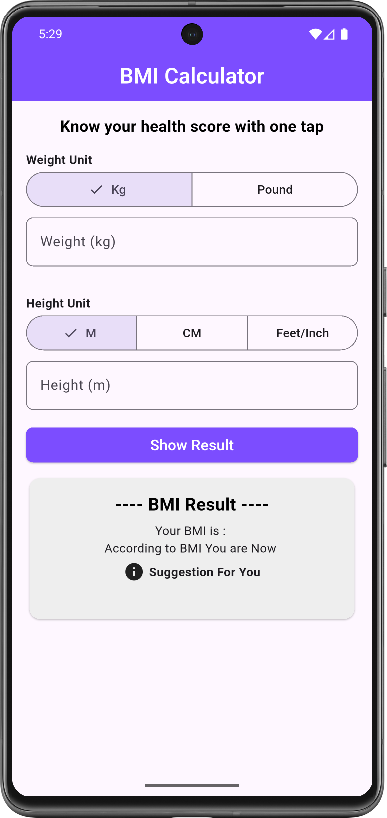
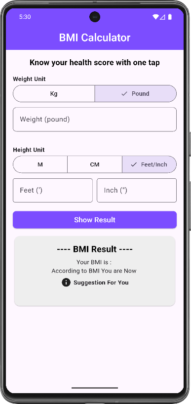
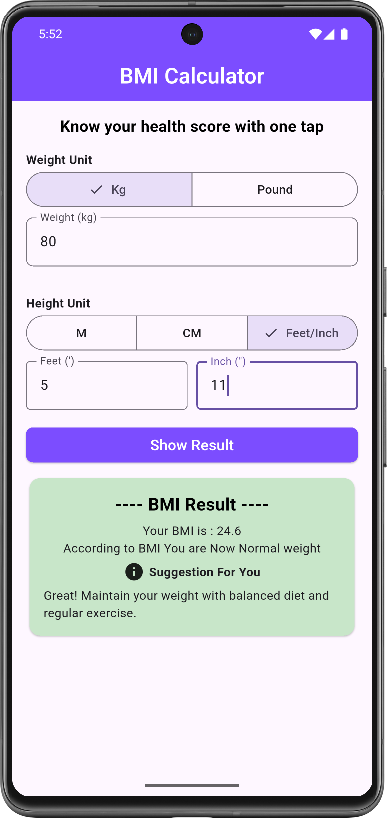

# bmi_calculator

A new Flutter project.

## 🧮 BMI App Preview

  <figure style="display:inline-block; text-align:center; margin:10px;">
    
    <figcaption>🏠 Home Screen</figcaption>
  </figure>

  <figure style="display:inline-block; text-align:center; margin:10px;">
    
    <figcaption>⚙️ Input Options</figcaption>
  </figure>

  <figure style="display:inline-block; text-align:center; margin:10px;">
    
    <figcaption>📊 Result Screen</figcaption>
  </figure>

  <figure style="display:inline-block; text-align:center; margin:10px;">
    
    <figcaption>💡 Status & Suggestion</figcaption>
  </figure>

